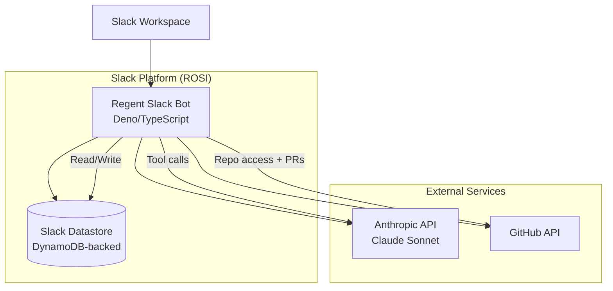
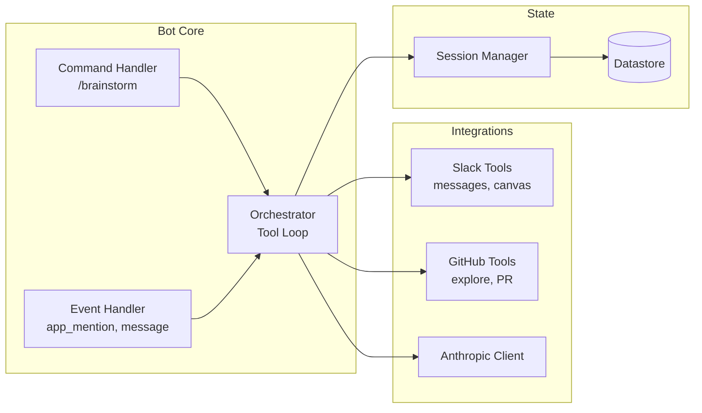
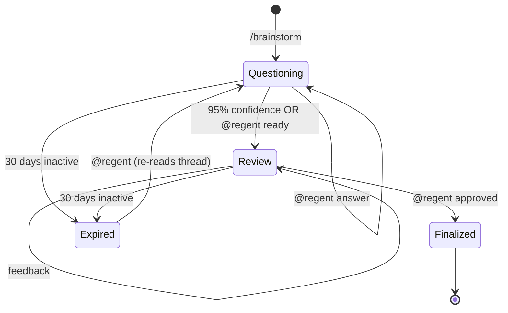

# Regent Slack Bot Specification

## Overview

Regent Slack Bot is a Slack-native collaborative brainstorming tool that enables teams to develop structured specifications with Claude's guidance directly in Slack. The bot conducts guided Q&A sessions in threads, asking one question at a time while allowing team-wide discussion, then synthesizes responses into a formal spec document delivered via Slack Canvas. When connected to a GitHub repository, the bot explores the codebase to provide context-aware questions and can automatically create PRs with finalized specs.

## Problem Statement

Software teams want AI involvement from the earliest stages of ideation, not just during implementation. Currently, spec development is either:

1. **Solo activity** - One person writes a spec in isolation, missing team insights
2. **Unstructured meetings** - Teams brainstorm in Slack/meetings without methodical exploration
3. **Post-hoc AI assistance** - LLMs help polish existing specs but don't guide discovery

Regent Slack Bot addresses the gap between "raw idea" and "structured spec" by providing a facilitated, team-inclusive brainstorming experience that ensures all critical aspects are explored before development begins.

## Goals and Non-Goals

### Goals

- Enable collaborative, AI-guided spec development in Slack
- Ask methodical questions that surface requirements, edge cases, and constraints
- Support team-wide participation (anyone can answer, discuss, or approve)
- Leverage existing codebase context when a repository is provided
- Produce structured specs compatible with Regent's local workflow
- Integrate seamlessly with GitHub for PR-based spec delivery

### Non-Goals

- **Not a local development tool** - The Claude Code plugin handles local execution
- **Not a code generator** - Produces specs, not implementations
- **Not a project management tool** - Does not track tasks or sprints
- **Not a general-purpose Slack bot** - Focused exclusively on spec brainstorming
- **Not real-time collaborative editing** - Canvas editing is async, not Google Docs-style

## User Personas

### Team Lead / Product Manager
- Initiates brainstorming sessions for new features
- Wants to ensure all requirements are captured before development
- Needs shareable artifact (Canvas/PR) for stakeholder review

### Senior Developer
- Provides technical constraints and architectural context
- Wants bot to understand existing codebase patterns
- Will use generated spec in local Regent workflow

### Junior Developer
- Participates in discussions to learn domain context
- Benefits from structured Q&A that surfaces non-obvious requirements
- Gains visibility into spec development process

### Cross-functional Participant (Designer, QA, etc.)
- Drops into thread to answer domain-specific questions
- Needs low friction participation (just `@regent` to answer)
- May not use the local Regent plugin

## Use Cases

### UC1: New Feature Brainstorm (with repo)

```
User: /brainstorm --repo acme/backend Add user preference management

Bot: Let me explore your codebase to understand the current architecture...
     [explores repo]

Bot: I see you have a `UserProfile` model with basic fields and use SQLAlchemy.
     What types of preferences should users be able to configure?

Team member 1: Theme, notification settings, default dashboard view
Team member 2: Also timezone and language

User: @regent Theme (light/dark/system), notification channels (email/slack/in-app),
      dashboard layout, timezone, and locale

Bot: Should preferences be scoped per-workspace or global to the user?
...
[continues until 95% confidence]

Bot: I've drafted a spec based on our discussion. Creating canvas for review...
     [creates canvas]

Bot: Please review the canvas above. You can:
     - Give feedback here: @regent <feedback>
     - Edit the canvas directly
     - When ready: @regent approved

User: @regent approved

Bot: Spec finalized! Creating PR to acme/backend...
     [creates PR with .regent/user-preference-management/brainstorm.md]
```

### UC2: Exploratory Brainstorm (no repo)

```
User: /brainstorm We need a better way to handle customer onboarding

Bot: What's the current onboarding process, and what are its main pain points?

User: @regent Manual account setup, lots of back-and-forth emails,
      no visibility into progress

Bot: Who are the key personas involved in onboarding?
...
[continues through Q&A, creates canvas]

Bot: Spec finalized! The canvas is available for download or copy/paste
     into your spec documents.
```

### UC3: Resume Interrupted Session

```
[Thread from yesterday, bot asked a question, no response]

User: @regent sorry, got pulled into fires. Let me answer that...
      @regent The API should support both REST and GraphQL

Bot: No problem! I see we left off discussing API design.
     [re-reads thread to restore context]
     Should authentication use your existing OAuth2 system or need
     a separate mechanism?
```

### UC4: Attachment Processing

```
User: /brainstorm Implement the design in this mockup
      [attaches image: dashboard-mockup.png]

Bot: I can see the dashboard mockup with three main sections...
     [describes what it sees]
     What data sources should populate each of these widgets?
```

## Technical Architecture

### Infrastructure Overview



### Component Architecture



### Data Flow

1. **Trigger**: User invokes `/brainstorm` command
2. **Session Init**: Bot creates session record, posts intro message
3. **Repo Exploration** (if `--repo`): Bot explores codebase, posts findings
4. **Q&A Loop**: Bot asks questions, team discusses, official answers via `@regent`
5. **Confidence Check**: After each answer, bot evaluates if ready for draft
6. **Canvas Creation**: At 95% confidence, bot creates canvas with draft spec
7. **Review Loop**: Team provides feedback (thread or canvas edits), bot updates
8. **Finalization**: On `@regent approved`, bot creates PR (if repo) or marks complete

## Slack Integration

### Slash Command

```
/brainstorm [--repo owner/repo] <idea description>
```

**Parameters:**
- `--repo owner/repo` (optional): GitHub repository for context and PR creation
- `idea description` (required): Initial concept to explore

**Supported channels:**
- Public channels ✓
- Private channels ✓
- DMs ✗ (collaborative brainstorming requires a shared space)

**Response:**
- Creates thread with bot's first message
- If `--repo`: Posts "exploring codebase" status, then first question
- If no repo: Posts first question immediately

### Event Handlers

| Event | Trigger | Action |
|-------|---------|--------|
| `app_mention` | `@regent <text>` | Process as official answer or command |
| `message` | Any thread message | Store for context (don't respond unless mentioned) |
| `file_shared` | Attachment in thread | Process as additional context |

### Attachment Processing

**Supported file types:**
- **Images:** PNG, JPG, GIF, WebP (processed via Claude's vision API)
- **Text files:** Markdown, plain text, code files (extracted and included as context)
- **PDFs:** Text extracted and included as context

**Size limits:** Attachments follow Claude's input limits. Oversized files are noted but not processed.

**Processing:** When a file is shared in the thread, the bot:
1. Downloads the file from Slack
2. Extracts content (text) or prepares for vision API (images)
3. Includes in the next Claude request as additional context
4. References the attachment in follow-up questions when relevant

### Mention Commands

| Command | Action |
|---------|--------|
| `@regent <answer>` | Record as official answer to current question (first answer wins) |
| `@regent next` | Skip current question, ask next |
| `@regent ready` | Signal team is ready for draft (even if bot isn't at 95%) |
| `@regent <feedback>` | During review phase, provide feedback on draft |
| `@regent approved` | Finalize spec, create PR if applicable |

**Multiple Answers:** When multiple `@regent <answer>` responses are given for the same question, the first one is taken as the official answer. Subsequent answers are acknowledged but not used. If the team needs to change an answer, use `@regent <feedback>` to correct it.

### Canvas Integration

**Creation:**
- Canvas created only when bot reaches draft phase
- Contains full structured spec document
- Posted to thread with review instructions

**Updates:**
- Feedback provided via thread only (`@regent <feedback>`)
- Bot updates canvas in response to thread feedback
- Direct canvas edits are not monitored (keeps implementation simple)

**Fallback (if canvas creation fails):**
- Bot uploads `brainstorm.md` as a file attachment to the thread
- File can be downloaded and used directly with local Regent workflow

**Format:**
```markdown
# [Spec Title]

## Overview
...

## Problem Statement
...

[Full spec structure per Regent format]
```

## GitHub Integration

### Repository Context

When `--repo owner/repo` is provided:

1. **Initial Exploration:**
   - Bot posts: "Let me explore your codebase to understand the context..."
   - Reads key files: README, package.json/pyproject.toml, src/ structure
   - Searches for relevant existing code based on idea keywords
   - Posts summary: "I see you're using [framework], with [patterns]..."

2. **Contextual Questions:**
   - References existing code in questions
   - Suggests patterns that match codebase style
   - Identifies potential integration points

### Tools for Repo Exploration

| Tool | Purpose | Example |
|------|---------|---------|
| `read_file` | Read specific file contents | `read_file("src/models/user.py")` |
| `list_directory` | Browse directory structure | `list_directory("src/")` |
| `search_code` | Find code patterns | `search_code("def authenticate")` |

### PR Creation

**Trigger:** `@regent approved` when `--repo` was specified

**Target Branch:**
- Reads from `.regent/config.yml` in repo (if exists)
- Falls back to repository default branch

**PR Contents:**
```
.regent/{spec-name}/brainstorm.md
```

**PR Description:**
- Links to original Slack thread
- Lists participants
- Shows key decisions summary

**Config File Format (`.regent/config.yml`):**
```yaml
slack_bot:
  target_branch: develop  # default: repo's default branch
```

## AI Backend

### Model Configuration

- **Default Model:** `claude-sonnet-4-20250514`
- **Configurable via:** `ANTHROPIC_MODEL` environment variable
- **Max Tokens:** 4096 (configurable via `ANTHROPIC_MAX_TOKENS`)

### Tool Loop Architecture

The bot uses a simple tool loop (NOT Claude Agent SDK):

```typescript
async function processMessage(sessionContext: SessionContext, userMessage: string) {
  const messages = buildMessageHistory(sessionContext);
  messages.push({ role: 'user', content: userMessage });

  while (true) {
    const response = await anthropic.messages.create({
      model: process.env.ANTHROPIC_MODEL || 'claude-sonnet-4-20250514',
      max_tokens: 4096,
      system: buildSystemPrompt(sessionContext),
      messages,
      tools: getAvailableTools(sessionContext),
    });

    // Process tool uses
    const toolUses = response.content.filter(c => c.type === 'tool_use');
    if (toolUses.length === 0) {
      // No tools, extract text response
      return extractTextResponse(response);
    }

    // Execute tools and continue loop
    const toolResults = await executeTools(toolUses, sessionContext);
    messages.push({ role: 'assistant', content: response.content });
    messages.push({ role: 'user', content: toolResults });
  }
}
```

### System Prompt Structure

```markdown
You are Regent, a collaborative brainstorming facilitator. Your role is to
guide teams through structured spec development.

## Current Session
- Phase: {questioning|review|finalized}
- Repo: {owner/repo or "none"}
- Questions asked: {count}
- Confidence: {percentage}

## Codebase Context (if repo provided)
{summary of explored files and patterns}

## Guidelines
- Ask ONE question at a time
- Questions should be specific and actionable
- Reference existing code when relevant
- Track confidence toward complete spec
- When at 95% confidence, propose creating draft

## Thread History
{formatted Q&A history}
```

### Available Tools

**Slack Tools:**

| Tool | Parameters | Description |
|------|------------|-------------|
| `post_message` | `channel`, `thread_ts`, `text` | Post message to thread |
| `create_canvas` | `channel`, `title`, `content` | Create canvas with spec |
| `update_canvas` | `canvas_id`, `content` | Update canvas content |
| `read_thread` | `channel`, `thread_ts` | Read all thread messages |

**GitHub Tools (when repo provided):**

| Tool | Parameters | Description |
|------|------------|-------------|
| `read_file` | `repo`, `path` | Read file from repo |
| `list_directory` | `repo`, `path` | List directory contents |
| `search_code` | `repo`, `query` | Search code in repo |
| `create_pr` | `repo`, `branch`, `title`, `body`, `files` | Create PR with files |

### Confidence Scoring

The bot uses Claude's self-assessment to track confidence about spec completeness:

- **0-30%**: Core problem and goals still being defined
- **30-60%**: Key requirements emerging, major gaps remain
- **60-90%**: Most requirements covered, clarifying details
- **90-95%**: Near-complete, validating consistency
- **95%+**: Ready to draft

**Mechanism:** After each answer, the system prompt asks Claude to assess confidence as part of its reasoning. Claude considers:
- Coverage of standard spec sections (problem, goals, personas, use cases, constraints, success criteria)
- Internal consistency of requirements
- Specificity of answers (vague vs. concrete)
- Number of open questions remaining

This self-assessment approach keeps confidence evaluation flexible and contextual rather than rigid rule-based.

## Session Lifecycle

### State Machine



### Session States

| State | Description | Allowed Actions |
|-------|-------------|-----------------|
| `questioning` | Active Q&A | answer, next, ready, attach files |
| `review` | Canvas created, awaiting approval | feedback, edit canvas, approved |
| `finalized` | Spec complete | (read-only) |
| `expired` | Soft TTL reached | Any mention resumes from thread history |

### Datastore Schema

```typescript
interface BrainstormSession {
  // Primary key: channel_id + thread_ts
  id: string;                    // `${channel_id}:${thread_ts}`

  // Core state
  repo: string | null;           // "owner/repo" or null
  phase: 'questioning' | 'review' | 'finalized';

  // Canvas tracking
  canvas_id: string | null;      // Slack canvas ID once created

  // Metadata
  created_at: number;            // Unix timestamp
  updated_at: number;            // Unix timestamp
  ttl: number;                   // Unix timestamp (created_at + 30 days)

  // Participants
  initiator: string;             // User ID who started
  participants: string[];        // All user IDs who've contributed
}
```

### TTL and Resumption

- **Soft TTL:** 30 days from last activity
- **Expired sessions:** Record may be deleted, but thread history is source of truth
- **Resumption:** On any `@regent` mention in old thread:
  1. Check if session record exists
  2. If not, create new record and re-read entire thread (handling Slack API pagination for long threads)
  3. Rebuild context from thread history
  4. Continue from inferred state

**Thread History:** The bot always re-reads thread history from Slack rather than storing message content. This keeps the datastore lightweight and ensures the bot always has the freshest context. For long threads with 100+ messages, pagination is handled automatically.

## Error Handling

### Strategy

Errors are displayed verbosely in thread (developer audience appreciates detail):

```
:warning: Error: GitHub API rate limit exceeded (5000/hour)
Retry in: 23 minutes
Action: Your answer has been recorded. I'll continue once rate limit resets.
```

### Error Categories

| Category | Example | Response |
|----------|---------|----------|
| **Transient** | API timeout, rate limit | Retry with backoff, inform user |
| **Auth** | Invalid GitHub token | Clear error message, cannot proceed |
| **User** | Invalid repo format | Explain correct format, prompt retry |
| **Internal** | Tool execution failed | Log details, apologize, suggest retry |

### Specific Scenarios

**GitHub repo not found:**
```
:x: Repository 'acme/nonexistent' not found or not accessible.
Please check:
- Repository exists and is spelled correctly
- The Regent bot has access to this repository
You can continue without repo context or try a different repository.
```

**Anthropic API error:**
```
:x: AI service temporarily unavailable (503)
Your answer has been saved. Retrying in 30 seconds...
[auto-retries up to 3 times]
```

**Canvas creation failed:**
```
:x: Unable to create canvas. This may be a Slack permissions issue.
Falling back to message-based spec delivery...
[posts spec as formatted message instead]
```

## Security & Secrets

### Required Secrets

Configured as environment variables during ROSI deployment:

| Secret | Purpose | Scope |
|--------|---------|-------|
| `ANTHROPIC_API_KEY` | Claude API access | Per-deployment |
| `GITHUB_TOKEN` | Repo access + PR creation | Single bot-owned token |

### GitHub Token Permissions

The bot uses a single GitHub token configured during deployment (not per-user OAuth). This simplifies setup but requires the token to have access to all repos the team wants to brainstorm about.

**Minimum required scopes (Personal Access Token):**
- `repo` - Full repository access (for private repos)
- `read:org` - Read org membership (for org repos)

**Or with GitHub App (recommended for organizations):**
- Repository contents: Read
- Pull requests: Read & Write
- Metadata: Read

**Note:** For private repos, the token owner must have access to the repo. If brainstorming against a repo the token can't access, the bot will report an error and continue without repo context.

### Security Considerations

1. **Token Storage:** Secrets stored in Slack's secure environment variables
2. **Repo Access:** Bot only accesses repos explicitly specified in commands
3. **Thread Privacy:** Bot only reads threads where it's been invoked
4. **Canvas Access:** Canvas inherits channel permissions
5. **No PII Storage:** Session state contains only IDs, not message content

## Repository Structure

The Regent project is organized as a monorepo containing both the Slack bot and the Claude Code plugin.

**Prerequisite:** Before implementing the Slack bot, the existing repository must be refactored from its current flat structure into the monorepo structure below.

```
regent/
├── README.md
├── packages/
│   ├── slack-bot/              # Slack bot (this spec)
│   │   ├── manifest.json       # Slack app manifest
│   │   ├── deno.json           # Deno configuration
│   │   ├── src/
│   │   │   ├── handlers/       # Slash command & event handlers
│   │   │   ├── integrations/   # Slack, GitHub, Anthropic clients
│   │   │   ├── tools/          # Claude tool implementations
│   │   │   └── state/          # Session & datastore management
│   │   └── tests/
│   │
│   └── claude-plugin/          # Claude Code plugin (existing, moved here)
│       ├── .claude-plugin/
│       │   └── plugin.json
│       ├── commands/           # Slash command definitions
│       └── agents/             # Specialized agent definitions
│
└── docs/                       # Shared documentation
```

### Migration from Current Structure

Current structure:
```
regent/
├── .claude-plugin/
├── commands/
├── agents/
└── ...
```

Migration steps:
1. Create `packages/` directory
2. Move existing plugin files to `packages/claude-plugin/`
3. Update any internal references
4. Create `packages/slack-bot/` for new bot code

### Package Relationship

- **slack-bot**: Standalone Slack app deployed via ROSI. No runtime dependency on claude-plugin.
- **claude-plugin**: Claude Code plugin installed by developers. Uses specs generated by slack-bot.
- **Shared artifacts**: The `brainstorm.md` format is the contract between them.

### Development Workflow

1. **Slack bot development**: `cd packages/slack-bot && slack run` (local dev mode)
2. **Plugin development**: Work directly in `packages/claude-plugin`, test via Claude Code
3. **Spec format changes**: Update both packages when `brainstorm.md` schema changes

## Deployment

### ROSI Deployment Process

1. **Prerequisites:**
   - Slack workspace admin access
   - Anthropic API key
   - GitHub token (if repo features needed)

2. **Create Slack App:**
   ```bash
   slack create regent-bot
   cd regent-bot
   ```

3. **Configure Manifest:**
   - Enable slash commands (`/brainstorm`)
   - Enable bot events (app_mention, message.channels, message.groups)
   - Enable canvas permissions
   - Configure datastore schema

4. **Set Secrets:**
   ```bash
   slack env add ANTHROPIC_API_KEY xxxxxxxxxxx
   slack env add GITHUB_TOKEN ghp_xxxxxxxxxxx
   ```

5. **Deploy:**
   ```bash
   slack deploy
   ```

6. **Install to Workspace:**
   - Follow Slack's OAuth flow
   - Grant requested permissions
   - Invite bot to channels as needed

### Configuration Options

| Env Variable | Default | Description |
|--------------|---------|-------------|
| `ANTHROPIC_API_KEY` | (required) | API key for Claude |
| `ANTHROPIC_MODEL` | `claude-sonnet-4-20250514` | Model to use |
| `ANTHROPIC_MAX_TOKENS` | `4096` | Max response tokens |
| `GITHUB_TOKEN` | (optional) | Token for repo access |
| `LOG_LEVEL` | `info` | Logging verbosity |

## Success Criteria

### Functional Requirements

- [ ] `/brainstorm` command creates thread and starts Q&A
- [ ] `--repo` flag enables codebase exploration
- [ ] Bot asks one question at a time
- [ ] Team discussions visible but don't trigger bot
- [ ] `@regent <answer>` records official answers
- [ ] `@regent next` and `@regent ready` control flow
- [ ] Canvas created at 95% confidence
- [ ] Canvas updates from both thread feedback and direct edits
- [ ] `@regent approved` creates PR when repo specified
- [ ] Sessions resume correctly after inactivity
- [ ] Attachments processed as context

### Non-Functional Requirements

- [ ] Response latency < 5 seconds (p95) for simple messages
- [ ] Response latency < 30 seconds (p95) for repo exploration
- [ ] Handles concurrent brainstorms in same workspace
- [ ] Graceful degradation when GitHub unavailable
- [ ] Clear error messages for all failure modes

### User Experience

- [ ] Zero-configuration start (just `/brainstorm`)
- [ ] Natural conversation flow (not robotic Q&A)
- [ ] Questions reference existing code when relevant
- [ ] Spec quality comparable to manual spec writing
- [ ] PR format ready for immediate local Regent use
