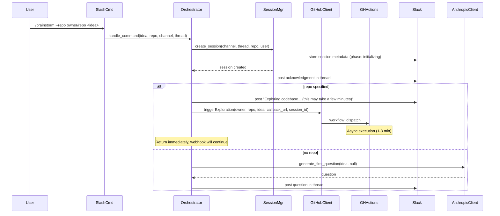

# Task Brief

## From Issue #52

**Task: Implement session initialization with GHA exploration trigger**

Parent Epic: #42

## Task Description

Implement the session initialization flow that triggers GitHub Actions exploration asynchronously.

**Type**: test-first

### Implementation Steps

1. Write tests for slash command handling with --repo flag
2. Write tests for workflow_dispatch trigger via GitHub API
3. Write tests for "exploring..." status message posting
4. Write tests for error handling (workflow trigger failure)
5. Implement initialization flow in SessionOrchestrator

### Flow Diagram



### GitHubClient Method (from Design Document)

```typescript
interface GitHubClient {
  /** Trigger exploration workflow in regent-exploration-service. */
  triggerExploration(
    targetRepo: string,    // "owner/repo"
    idea: string,
    callbackUrl: string,   // ROSI webhook URL
    sessionId: string
  ): Promise<void>;
}
```

### Session Phase Transitions

- Created with `--repo`: `initializing` → (wait for webhook) → `questioning`
- Created without repo: `initializing` → `questioning` (immediate)

## Acceptance Criteria

- Session created in `initializing` phase when --repo specified
- Workflow_dispatch triggered with correct inputs
- "Exploring codebase..." message posted immediately
- Function returns without waiting for exploration to complete
- Workflow trigger failures handled gracefully

_Requirements: 1.1, 1.2, 2.1, 2.2, 2.6_

## Codebase Context

### Current Implementation State

#### SessionOrchestrator (`slackbot/src/orchestrators/session-orchestrator.ts`)

**Current flow (lines 83-116):**
```typescript
async handleSlashCommand(command: SlashCommand, threadTs: string): Promise<void> {
  // 1. Post acknowledgment message
  await this.postAcknowledgment(command, threadTs);

  // 2. Create session record
  await this.sessionManager.createSession(
    command.channelId,
    threadTs,
    command.repository ?? "",
    command.userId,
  );

  // 3. Explore repository if provided
  let repositoryContext: RepositoryContext | null = null;
  if (command.repository) {
    repositoryContext = await this.exploreRepositoryWithErrorHandling(command, threadTs);
    // Caches result in this.repositoryContextCache
  }

  // 4. Generate and post first question
  await this.generateAndPostFirstQuestion(command, threadTs, repositoryContext);
}
```

**Key observation:** The current implementation **blocks** on `exploreRepositoryWithErrorHandling()` - it waits for full repository exploration before posting the first question. The task requires making this **asynchronous** via workflow_dispatch trigger instead.

**Existing error handling patterns (lines 155-193):**
- Validation errors → `ValidationError` thrown
- GitHub access errors → `GitHubAccessError` caught and handled gracefully
- Unexpected errors → re-thrown

#### SessionManager (`slackbot/src/managers/session-manager.ts`)

**Current session creation (lines 77-112):**
```typescript
async createSession(
  channelId: string,
  threadTs: string,
  repo: string,
  userId: string,
): Promise<Session> {
  // Creates session with:
  // - session_id: "channelId:threadTs"
  // - phase: Phase.Questioning (ALWAYS - see line 99)
  // - repository: repo or undefined
  // - initiator_user_id: userId
  // - confidence_score: 0
  // - created_at and ttl (30 days)

  // Currently NO support for "initializing" phase
}
```

**Critical finding:** The `Phase` enum (`session.ts:10-19`) only has three phases:
- `Questioning` (initial phase)
- `Review`
- `Finalized`

**There is NO `Initializing` phase defined.** This needs to be added to the Phase enum.

#### GitHubClient Interface (`slackbot/src/clients/github-client.ts`)

**Current interface:**
```typescript
export interface GitHubClient {
  exploreRepository(owner: string, repo: string): Promise<RepositoryContext>;
  createPullRequest(...): Promise<string>;
  getDefaultBranch(owner: string, repo: string): Promise<string>;
  checkAccess(owner: string, repo: string): Promise<boolean>;
  createIssue(...): Promise<{ number: number; url: string }>;
  getIssue(...): Promise<GitHubIssue>;
  getIssueComments(...): Promise<GitHubComment[]>;
  createIssueComment(...): Promise<GitHubComment>;
  updateIssueComment(...): Promise<GitHubComment>;
}
```

**Missing method:** There is NO `triggerExploration()` method. This needs to be added.

**MockGitHubClient** provides:
- Error injection via `setExploreRepositoryError()`, `setCheckAccessError()`, etc.
- Configurable responses
- Recording of operations for assertions
- `clear()` method to reset state between tests

**GitHubClientImpl** uses:
- `RetryHandler` for transient error retry with exponential backoff
- Standard GitHub API authentication headers

### Test Template Reference

**Similar Test File**: `slackbot/tests/orchestrators/session-orchestrator.test.ts`

**Setup patterns:**
```typescript
beforeEach(() => {
  datastore = new MockDatastoreClient();
  sessionManager = new SessionManager(datastore);
  githubClient = new MockGitHubClient();
  anthropicClient = new MockAnthropicClient();
  messagingClient = new MockSlackMessagingClient();
  orchestrator = new SessionOrchestrator(
    sessionManager,
    githubClient,
    anthropicClient,
    messagingClient,
  );
});

afterEach(() => {
  datastore.clear();
  githubClient.clear();
  anthropicClient.clear();
  messagingClient.clear();
});
```

**Test helper pattern:**
```typescript
const createSlashCommand = (overrides?: Partial<SlashCommand>): SlashCommand => ({
  idea: "build a feature",
  channelId: "C1234567890",
  userId: "U1234567890",
  channelType: "channel",
  responseUrl: "https://hooks.slack.com/commands/123/456",
  ...overrides,
});
```

**Custom mock extension pattern:**
```typescript
class ConfigurableMockGitHubClient extends MockGitHubClient {
  private exploreResult: RepositoryContext | null = null;
  public lastExploreCall: { owner: string; repo: string } | null = null;

  setExploreRepositoryResult(context: RepositoryContext): void {
    this.exploreResult = context;
  }

  override exploreRepository(owner: string, repo: string): Promise<RepositoryContext> {
    this.lastExploreCall = { owner, repo };
    if (this.exploreResult) {
      return Promise.resolve(this.exploreResult);
    }
    return super.exploreRepository(owner, repo);
  }
}
```

### Project Conventions

**Import Style:**
```typescript
import type { Session } from "../types/session.ts";
import { Phase } from "../types/session.ts";
import { assertEquals, assertExists } from "@std/assert";
import { afterEach, beforeEach, describe, it } from "@std/testing/bdd";
```

**Error Handling Pattern:**
```typescript
import { ValidationError, GitHubAccessError } from "../errors/types.ts";

try {
  // operation
} catch (error) {
  if (error instanceof GitHubAccessError) {
    const slackMessage = error.toSlackMessage();
  } else if (error instanceof ValidationError) {
    // Handle validation error
  }
  throw error;
}
```

**Key error types:**
- `BaseError` (abstract) - has `type`, `isRetryable`, `details`, `suggestedAction`, `toSlackMessage()`
- `TransientError` (retryable) - rate limits, timeouts
- `PermanentError` (non-retryable) - invalid input, auth failures
- `GitHubAccessError` - 401/403/422/404 responses
- `ValidationError` - format/input validation

### Exploration Callback Flow (Already Implemented)

The callback handler (`slackbot/src/handlers/exploration-handler.ts`) is already implemented. It:
1. Validates the Authorization header (Bearer token)
2. Receives an `ExplorationCallback` (success or error)
3. Routes to `SessionOrchestrator.handleExplorationResult()`

**The callback structure** (`slackbot/src/types/exploration-callback.ts`):
```typescript
// Success case:
{
  session_id: "C1234567890:1234567890.123456",
  status: "success",
  exploration_context: { ... }
}

// Error case:
{
  session_id: "C1234567890:1234567890.123456",
  status: "error",
  error: { message: string, code: "CLONE_FAILED" | "INSTALL_FAILED" | "EXPLORATION_FAILED" }
}
```

### GitHub Actions Workflow Trigger Format

The explore-codebase workflow (`.github/workflows/explore-codebase.yml`) expects:
```typescript
workflow_dispatch:
  inputs:
    target_repo: string,     // 'Repository to explore (owner/repo format)'
    idea: string,            // 'The idea/feature being brainstormed'
    callback_url: string,    // 'URL to POST results to'
    session_id: string       // 'Session ID for correlation'
```

### Files to Modify

1. **`slackbot/src/types/session.ts`**
   - Add `Initializing = "initializing"` to Phase enum
   - Update documentation

2. **`slackbot/src/clients/github-client.ts`**
   - Add `triggerExploration()` to GitHubClient interface
   - Implement in GitHubClientImpl class
   - Add error injection to MockGitHubClient for testing

3. **`slackbot/src/managers/session-manager.ts`**
   - Update `createSession()` to accept optional phase parameter
   - Default to `Initializing` when repo provided, `Questioning` when not

4. **`slackbot/src/orchestrators/session-orchestrator.ts`**
   - Refactor `handleSlashCommand()`:
     - If repo: create session in `Initializing`, post "Exploring...", trigger workflow, return
     - If no repo: create session in `Questioning`, generate first question (existing flow)

5. **New test file**: `slackbot/tests/orchestrators/session-orchestrator-initialization.test.ts`
   - Tests for slash command handling with --repo flag
   - Tests for workflow_dispatch trigger
   - Tests for "exploring..." message posting
   - Tests for error handling

### Files to Reference (No Changes Needed)

- `slackbot/src/handlers/exploration-handler.ts` - Shows callback validation and routing
- `slackbot/src/types/exploration-callback.ts` - Callback structure
- `slackbot/tests/orchestrators/session-orchestrator.test.ts` - Test patterns

### Key Implementation Insights

1. **No blocking on exploration:** The new flow must return immediately after triggering the workflow
2. **Session phase tracking:** The Initializing phase needs to be added
3. **Mock testing:** Extend MockGitHubClient to track `triggerExploration()` calls
4. **Error handling:** Workflow trigger failures should inform user in Slack
5. **Callback URL:** Will need to come from environment or configuration
6. **Webhook authentication:** Already validated in exploration-handler.ts

---
*Branch: feature/regent-slack-bot*
*Generated at execution time by Regent*
