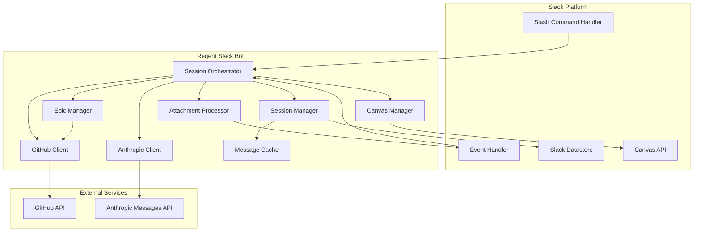
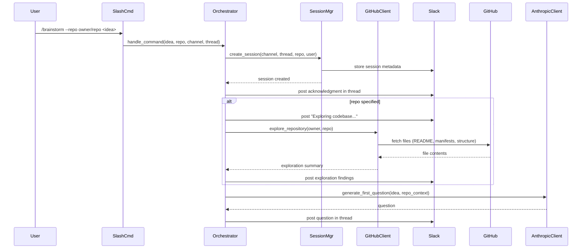
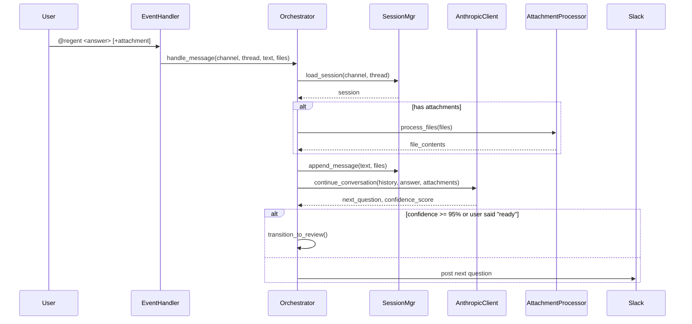
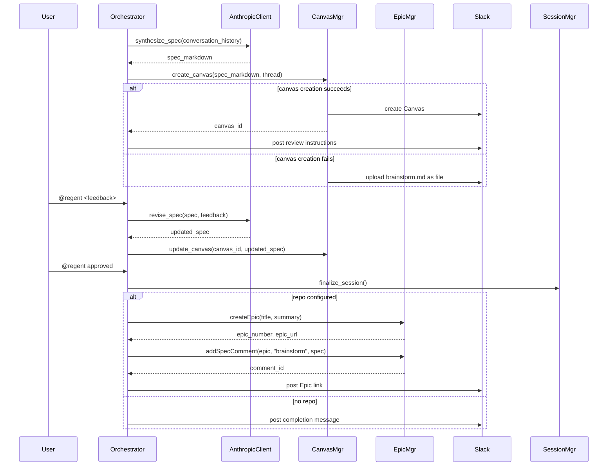

# Design Document

## Overview

The Regent Slack Bot is a conversational AI system that facilitates collaborative specification development directly in Slack. The design follows a stateful orchestrator pattern where a central Orchestrator component manages the conversation flow through distinct phases (questioning, review, finalized), delegating specialized work to focused components like the GitHub Client for repository exploration and the Canvas Manager for document creation.

The system is built on Slack's ROSI (Run On Slack Infrastructure) platform, which provides a serverless Deno/TypeScript runtime with integrated authentication and datastore capabilities. This design satisfies the requirements by maintaining session state across potentially long-running conversations (up to 30 days), supporting concurrent sessions through channel+thread identification, and integrating with both GitHub (for codebase context and Epic-based spec storage) and the Anthropic Messages API (for Claude's conversational intelligence).

Key integration points include: (1) Slack's event and command infrastructure for message handling, (2) Slack Datastore for durable session metadata, (3) GitHub API through an abstracted client for repository exploration and Epic issue management, (4) Slack Canvas API for collaborative document editing during review, and (5) Anthropic Messages API for Claude's natural language understanding and spec synthesis. Finalized specs are stored as collapsible comments on GitHub Epic issues rather than committed to the repository, reducing permission requirements to `repo:read` + `issues:write`. The existing Regent Claude Code plugin defines the `brainstorm.md` format that this bot produces, ensuring compatibility with the local Regent workflow.

## Architecture

### System Components



**Component Responsibilities:**

- **Slash Command Handler**: Receives `/brainstorm` commands from Slack, validates input, and routes to Orchestrator
- **Event Handler**: Receives app_mention and message events, filters for relevant threads, and routes to Orchestrator
- **Session Orchestrator**: Manages conversation state machine (questioning → review → finalized), coordinates between components, and implements the Claude tool loop
- **Session Manager**: Handles session persistence (create, load, update, resume from history), manages TTL, and maintains message cache
- **GitHub Client**: Abstracts GitHub API interactions for repository exploration, issue/comment CRUD, and Epic management, designed to support future GitHub App integration
- **Epic Manager**: Manages spec documents as collapsible comments on GitHub Epic issues, handles comment creation/update with `<!-- REGENT_SPEC:{type} -->` markers
- **Anthropic Client**: Manages Claude Messages API requests with tool use, handles retries, and tracks confidence scores
- **Canvas Manager**: Creates and updates Slack Canvas documents, with fallback to file upload
- **Attachment Processor**: Downloads and processes file attachments (images, text, PDFs) for inclusion in Claude requests
- **Message Cache**: In-memory cache of thread messages during active session, rebuilt from Slack history on resume

### Session Initialization Flow



The Orchestrator initializes a new session by creating a unique record keyed by channel ID and thread timestamp, then conditionally performs repository exploration before asking the first question. Repository exploration failures result in an error message and an offer to continue without repository context.

### Question-Answer Loop Flow



The Orchestrator maintains conversation history in the Message Cache during active sessions, appending each user answer and Claude question. When the confidence score reaches 95% or the user posts `@regent ready`, the system transitions to review phase.

### Review and Finalization Flow



During review phase, the Orchestrator synthesizes the conversation into a structured spec document following the Regent brainstorm.md format, creates a Canvas for team review, and processes feedback until approval. Upon approval, if a repository is configured, the system creates a GitHub Epic issue and stores the spec as a collapsible comment; otherwise it marks the session complete. The Epic URL is posted to Slack for the team to continue with `/regent:specify --epic N` and subsequent commands.

## Components and Interfaces

### SessionOrchestrator

**Responsibility**: Manages the conversation lifecycle through a state machine (questioning → review → finalized), coordinates all other components, and implements the Claude tool loop for adaptive questioning and spec synthesis.

**Dependencies**: SessionManager, AnthropicClient, GitHubClient, CanvasManager, AttachmentProcessor

**Key Methods:**

```typescript
interface SessionOrchestrator {
  /** Process /brainstorm command and initialize session. */
  handleSlashCommand(command: SlashCommand): Promise<void>;

  /** Process @regent mentions and official answers. */
  handleMessage(event: MessageEvent): Promise<void>;

  /** Move session from questioning to review phase. */
  transitionToReview(session: Session): Promise<void>;

  /** Complete session and optionally create PR. */
  finalizeSession(session: Session): Promise<void>;

  /** Execute Claude Messages API tool loop until response ready. */
  runToolLoop(session: Session, userInput: string): Promise<Response>;
}
```

### SessionManager

**Responsibility**: Handles persistence of session metadata to Slack Datastore, manages session TTL (30 days), rebuilds context from Slack thread history on resume, and maintains the in-memory Message Cache during active sessions.

**Dependencies**: Slack Datastore, Slack Messages API, MessageCache

**Key Methods:**

```typescript
interface SessionManager {
  /** Create new session record with TTL. */
  createSession(channelId: string, threadTs: string, repo: string, userId: string): Promise<Session>;

  /** Load session from datastore or rebuild from thread history. */
  loadSession(channelId: string, threadTs: string): Promise<Session>;

  /** Persist session state changes. */
  updateSession(session: Session): Promise<void>;

  /** Add message to cache and update session. */
  appendMessage(session: Session, message: Message): Promise<void>;

  /** Recreate session by re-reading entire Slack thread. */
  rebuildFromHistory(channelId: string, threadTs: string): Promise<Session>;
}
```

### GitHubClient

**Responsibility**: Abstracts GitHub API interactions for repository exploration (reading key files, understanding structure), issue management, and comment CRUD for Epic-based spec storage. Designed with an abstraction layer to support future migration from personal access token to GitHub App authentication.

**Dependencies**: GitHub REST API

**Key Methods:**

```typescript
interface GitHubClient {
  /** Read README, manifests, and directory structure. */
  exploreRepository(owner: string, repo: string): Promise<RepositoryContext>;

  /** Determine target branch from .regent/config.yml or repo default. */
  getDefaultBranch(owner: string, repo: string): Promise<string>;

  /** Verify token has read/write access to repository. */
  checkAccess(owner: string, repo: string): Promise<boolean>;

  /** Create a new issue in the repository. */
  createIssue(owner: string, repo: string, title: string, body: string, labels?: string[]): Promise<{ number: number; url: string }>;

  /** Get an issue by number. */
  getIssue(owner: string, repo: string, issueNumber: number): Promise<GitHubIssue>;

  /** Get all comments on an issue. */
  getIssueComments(owner: string, repo: string, issueNumber: number): Promise<GitHubComment[]>;

  /** Create a comment on an issue. */
  createIssueComment(owner: string, repo: string, issueNumber: number, body: string): Promise<GitHubComment>;

  /** Update an existing issue comment. */
  updateIssueComment(owner: string, repo: string, commentId: number, body: string): Promise<GitHubComment>;
}
```

### EpicManager

**Responsibility**: Higher-level service for managing spec documents on GitHub Epic issues. Formats specs as collapsible `<details>` sections with marker comments for identification, and handles creation/update of spec comments.

**Dependencies**: GitHubClient

**Key Methods:**

```typescript
type SpecType = "brainstorm" | "requirements" | "design";

interface EpicManager {
  /** Create Epic issue with summary body and regent:epic label. */
  createEpic(owner: string, repo: string, title: string, summary: string): Promise<{ number: number; url: string }>;

  /** Add spec document as collapsible comment with marker. */
  addSpecComment(owner: string, repo: string, epicNumber: number, specType: SpecType, content: string): Promise<number>;

  /** Update existing spec comment (finds by marker). */
  updateSpecComment(owner: string, repo: string, commentId: number, specType: SpecType, content: string): Promise<void>;

  /** Get spec content from Epic (finds comment by marker). */
  getSpecContent(owner: string, repo: string, epicNumber: number, specType: SpecType): Promise<string | null>;

  /** Get all spec comments from Epic. */
  getSpecComments(owner: string, repo: string, epicNumber: number): Promise<Map<SpecType, { commentId: number; content: string }>>;
}
```

**Comment Format:**
```markdown
<!-- REGENT_SPEC:brainstorm -->
<details>

{content}
