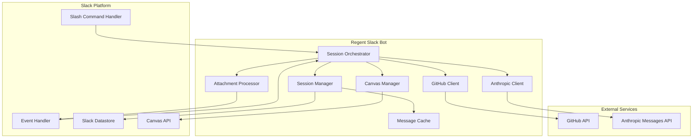
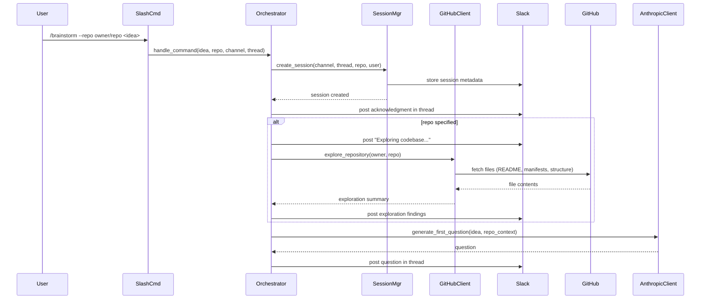
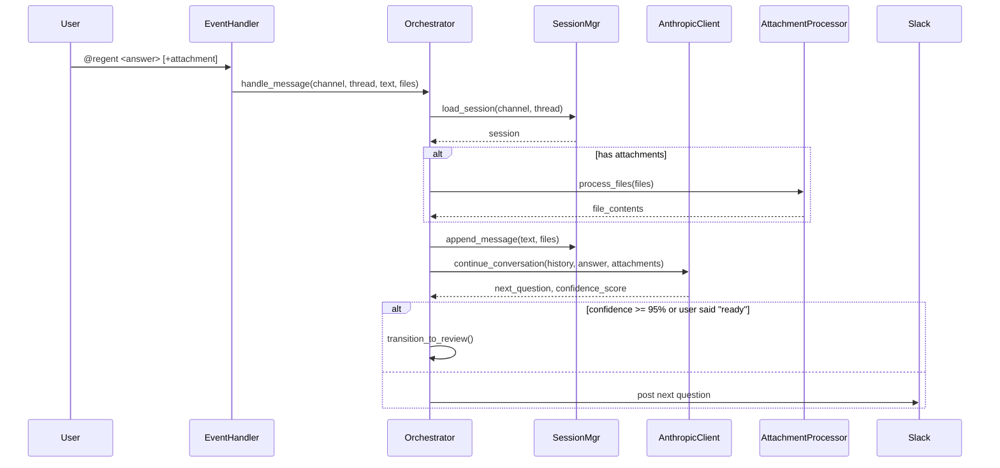
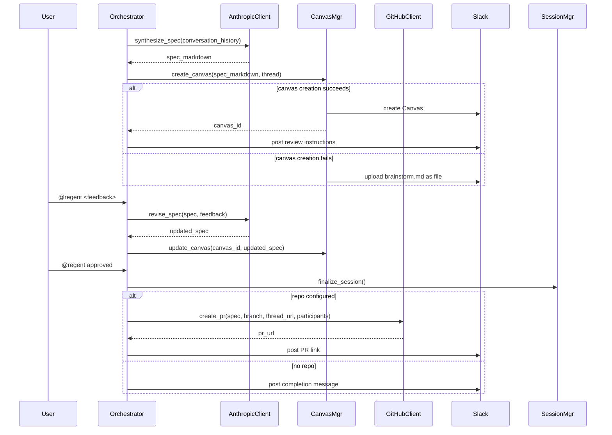

# Design Document

## Overview

The Regent Slack Bot is a conversational AI system that facilitates collaborative specification development directly in Slack. The design follows a stateful orchestrator pattern where a central Orchestrator component manages the conversation flow through distinct phases (questioning, review, finalized), delegating specialized work to focused components like the GitHub Client for repository exploration and the Canvas Manager for document creation.

The system is built on Slack's ROSI (Run On Slack Infrastructure) platform, which provides a serverless Deno/TypeScript runtime with integrated authentication and datastore capabilities. This design satisfies the requirements by maintaining session state across potentially long-running conversations (up to 30 days), supporting concurrent sessions through channel+thread identification, and integrating with both GitHub (for codebase context and PR creation) and the Anthropic Messages API (for Claude's conversational intelligence).

Key integration points include: (1) Slack's event and command infrastructure for message handling, (2) Slack Datastore for durable session metadata, (3) GitHub API through an abstracted client to support future GitHub App integration, (4) Slack Canvas API for collaborative document editing, and (5) Anthropic Messages API for Claude's natural language understanding and spec synthesis. The existing Regent Claude Code plugin defines the `brainstorm.md` format that this bot produces, ensuring compatibility with the local Regent workflow.

## Architecture

### System Components



**Component Responsibilities:**

- **Slash Command Handler**: Receives `/brainstorm` commands from Slack, validates input, and routes to Orchestrator
- **Event Handler**: Receives app_mention and message events, filters for relevant threads, and routes to Orchestrator
- **Session Orchestrator**: Manages conversation state machine (questioning → review → finalized), coordinates between components, and implements the Claude tool loop
- **Session Manager**: Handles session persistence (create, load, update, resume from history), manages TTL, and maintains message cache
- **GitHub Client**: Abstracts GitHub API interactions for repository exploration and PR creation, designed to support future GitHub App integration
- **Anthropic Client**: Manages Claude Messages API requests with tool use, handles retries, and tracks confidence scores
- **Canvas Manager**: Creates and updates Slack Canvas documents, with fallback to file upload
- **Attachment Processor**: Downloads and processes file attachments (images, text, PDFs) for inclusion in Claude requests
- **Message Cache**: In-memory cache of thread messages during active session, rebuilt from Slack history on resume

### Session Initialization Flow



The Orchestrator initializes a new session by creating a unique record keyed by channel ID and thread timestamp, then conditionally performs repository exploration before asking the first question. Repository exploration failures result in an error message and an offer to continue without repository context.

### Question-Answer Loop Flow



The Orchestrator maintains conversation history in the Message Cache during active sessions, appending each user answer and Claude question. When the confidence score reaches 95% or the user posts `@regent ready`, the system transitions to review phase.

### Review and Finalization Flow



During review phase, the Orchestrator synthesizes the conversation into a structured spec document following the Regent brainstorm.md format, creates a Canvas for team review, and processes feedback until approval. Upon approval, if a repository is configured, the system creates a PR; otherwise it marks the session complete.

## Components and Interfaces

### SessionOrchestrator

**Responsibility**: Manages the conversation lifecycle through a state machine (questioning → review → finalized), coordinates all other components, and implements the Claude tool loop for adaptive questioning and spec synthesis.

**Dependencies**: SessionManager, AnthropicClient, GitHubClient, CanvasManager, AttachmentProcessor

**Key Methods:**

```typescript
interface SessionOrchestrator {
  /** Process /brainstorm command and initialize session. */
  handleSlashCommand(command: SlashCommand): Promise<void>;

  /** Process @regent mentions and official answers. */
  handleMessage(event: MessageEvent): Promise<void>;

  /** Move session from questioning to review phase. */
  transitionToReview(session: Session): Promise<void>;

  /** Complete session and optionally create PR. */
  finalizeSession(session: Session): Promise<void>;

  /** Execute Claude Messages API tool loop until response ready. */
  runToolLoop(session: Session, userInput: string): Promise<Response>;
}
```

### SessionManager

**Responsibility**: Handles persistence of session metadata to Slack Datastore, manages session TTL (30 days), rebuilds context from Slack thread history on resume, and maintains the in-memory Message Cache during active sessions.

**Dependencies**: Slack Datastore, Slack Messages API, MessageCache

**Key Methods:**

```typescript
interface SessionManager {
  /** Create new session record with TTL. */
  createSession(channelId: string, threadTs: string, repo: string, userId: string): Promise<Session>;

  /** Load session from datastore or rebuild from thread history. */
  loadSession(channelId: string, threadTs: string): Promise<Session>;

  /** Persist session state changes. */
  updateSession(session: Session): Promise<void>;

  /** Add message to cache and update session. */
  appendMessage(session: Session, message: Message): Promise<void>;

  /** Recreate session by re-reading entire Slack thread. */
  rebuildFromHistory(channelId: string, threadTs: string): Promise<Session>;
}
```

### GitHubClient

**Responsibility**: Abstracts GitHub API interactions for repository exploration (reading key files, understanding structure) and PR creation. Designed with an abstraction layer to support future migration from personal access token to GitHub App authentication.

**Dependencies**: GitHub REST API

**Key Methods:**

```typescript
interface GitHubClient {
  /** Read README, manifests, and directory structure. */
  exploreRepository(owner: string, repo: string): Promise<RepositoryContext>;

  /** Create PR with brainstorm.md in .regent/{spec-name}/ directory. */
  createPullRequest(
    owner: string,
    repo: string,
    spec: SpecDocument,
    threadUrl: string,
    participants: string[]
  ): Promise<string>;

  /** Determine target branch from .regent/config.yml or repo default. */
  getDefaultBranch(owner: string, repo: string): Promise<string>;

  /** Verify token has read/write access to repository. */
  checkAccess(owner: string, repo: string): Promise<boolean>;
}
```

### AnthropicClient

**Responsibility**: Manages Claude Messages API requests with tool use, implements retry logic for transient errors, tracks confidence scores throughout the conversation, and synthesizes the final spec document.

**Dependencies**: Anthropic Messages API

**Key Methods:**

```typescript
interface AnthropicClient {
  /** Generate next question based on conversation history. */
  continueConversation(messages: Message[], repoContext: RepositoryContext): Promise<QuestionResponse>;

  /** Convert conversation into structured brainstorm.md format. */
  synthesizeSpec(messages: Message[]): Promise<SpecDocument>;

  /** Update spec based on review feedback. */
  reviseSpec(spec: SpecDocument, feedback: string): Promise<SpecDocument>;

  /** Parse Claude's self-assessed confidence (0-100%). */
  extractConfidenceScore(response: AnthropicMessage): number;
}
```

### CanvasManager

**Responsibility**: Creates and updates Slack Canvas documents containing the spec, implements fallback to file upload if Canvas API fails, and formats content according to Slack's Canvas markdown syntax.

**Dependencies**: Slack Canvas API

**Key Methods:**

```typescript
interface CanvasManager {
  /** Create Canvas with spec content, fallback to file upload on failure. */
  createCanvas(spec: SpecDocument, threadTs: string, channelId: string): Promise<string>;

  /** Update existing Canvas with revised spec. */
  updateCanvas(canvasId: string, spec: SpecDocument): Promise<void>;

  /** Convert spec markdown to Canvas-compatible format. */
  formatForCanvas(spec: SpecDocument): string;
}
```

### AttachmentProcessor

**Responsibility**: Downloads file attachments from Slack, processes different file types (images via vision API, text extraction from PDFs and code files), and formats content for inclusion in Claude requests.

**Dependencies**: Slack Files API, Anthropic Vision API

**Key Methods:**

```typescript
interface AttachmentProcessor {
  /** Download and process all attachments in a message. */
  processFiles(files: SlackFile[]): Promise<ProcessedAttachment[]>;

  /** Prepare image for Claude vision API. */
  processImage(file: SlackFile): Promise<VisionContent>;

  /** Extract text from PDF, markdown, or code files. */
  extractText(file: SlackFile): Promise<string>;

  /** Verify file doesn't exceed Claude input limits. */
  checkSizeLimits(file: SlackFile): boolean;
}
```

### MessageCache

**Responsibility**: Provides in-memory caching of thread messages during active sessions to reduce Slack API calls, with automatic eviction when sessions expire.

**Dependencies**: None (in-memory only)

**Key Methods:**

```typescript
interface MessageCache {
  /** Retrieve cached messages for session. */
  get(sessionId: string): Message[];

  /** Add message to session cache. */
  append(sessionId: string, message: Message): void;

  /** Clear cache for expired or finalized session. */
  evict(sessionId: string): void;
}
```

## Data Models

### Session

Represents a single brainstorming conversation in a specific channel thread. Sessions are identified by the combination of channel ID and thread timestamp, ensuring uniqueness across concurrent sessions.

**Key Attributes:**
- `session_id`: Composite key `{channel_id}:{thread_ts}`
- `repository`: Optional GitHub repository in `owner/repo` format
- `phase`: Current state (questioning, review, finalized)
- `initiator_user_id`: User who started the session
- `canvas_id`: Slack Canvas identifier (set during review phase)
- `confidence_score`: Claude's current confidence (0-100%)
- `created_at`: Session creation timestamp
- `ttl`: Expiration timestamp (created_at + 30 days)

**Relationships:**
- Has many Message (cached in memory during active session)
- Belongs to Slack Channel and Thread

### Message

Represents a single message in the conversation thread, including both user answers and bot questions.

**Key Attributes:**
- `sender`: User ID or "bot"
- `text`: Message content
- `timestamp`: Message timestamp from Slack
- `is_official_answer`: Whether message started with `@regent`
- `attachments`: List of processed file contents

**Relationships:**
- Belongs to Session

### SpecDocument

Represents the structured specification document in Regent brainstorm.md format.

**Key Attributes:**
- `title`: Spec title
- `overview`: High-level summary
- `problem_statement`: Problem being solved
- `goals`: What the project will accomplish
- `non_goals`: Explicitly out of scope items
- `personas`: User roles and descriptions
- `use_cases`: Concrete usage scenarios
- `technical_details`: Architecture notes, constraints, decisions
- `open_questions`: Remaining uncertainties

**Relationships:**
- Belongs to Session
- Rendered as Canvas or uploaded file

### RepositoryContext

Contains information extracted from GitHub repository exploration to inform Claude's questions.

**Key Attributes:**
- `framework`: Detected framework (React, FastAPI, etc.)
- `patterns`: Identified architectural patterns
- `relevant_files`: Key files referenced in questions
- `structure`: Directory layout summary

**Relationships:**
- Belongs to Session (if repo configured)
- Used by AnthropicClient for contextual questioning

### Existing Infrastructure

**Slack Datastore**: Provides DynamoDB-backed persistence for Session records. The Datastore is scoped to the Slack workspace and automatically handles authentication. Sessions are stored with a TTL attribute that triggers automatic deletion after 30 days.

**Slack Canvas API**: Allows programmatic creation and editing of Canvas documents. This system uses Canvas as the primary delivery mechanism for draft and final specs. Canvases are linked to threads but exist as separate document entities.

**Slack Event and Command Infrastructure**: The ROSI platform automatically routes slash commands to registered handlers and delivers app_mention and message events to the event handler. The system does not need to implement webhook endpoints or authentication logic.

**Regent Claude Code Plugin**: Defines the `brainstorm.md` format through the `regent-brainstorm-writer` agent. This Slack bot produces spec documents that exactly match the format expected by the local Regent workflow (`/regent:specify` command).

**GitHub API**: Provides repository access for exploration (reading files via Contents API) and PR creation (via Pull Requests API). The design uses an abstraction layer (GitHubClient) to isolate authentication logic, enabling future migration from personal access token to GitHub App.

**Anthropic Messages API**: Provides Claude's natural language understanding and generation capabilities. The system uses the Messages API with tool use (not the Agent SDK) to implement the adaptive questioning flow and spec synthesis.

## Correctness Properties

*Properties are invariants that must hold across all valid executions of the system. Each property bridges requirements to testable guarantees.*

**Property 1: Session Isolation**
*For any* two concurrent sessions in different threads, *there should be* no shared state or cross-contamination of messages
**Validates:** Requirements 9.1, 9.3, 9.4

**Property 2: Answer Recording**
*For any* message prefixed with `@regent` in a session thread, *the system should* record the message as an official answer before generating the next question
**Validates:** Requirements 3.2, 7.4

**Property 3: Single Question Rule**
*For any* response in questioning phase, *the system should* ask exactly one question unless transitioning to review phase
**Validates:** Requirements 3.1, 3.6

**Property 4: Phase Transition Triggers**
*If* confidence score reaches 95% or user posts `@regent ready`, *then* the system must transition to review phase and create a Canvas
**Validates:** Requirements 3.5, 3.6, 5.1

**Property 5: Repository Access Validation**
*For any* session with repository configured, *if* GitHub token lacks access, *then* the system should display an error and offer to continue without repository context
**Validates:** Requirements 2.4, 10.5

**Property 6: Session Resumption Completeness**
*For any* session resumed after expiration, *the system should* rebuild the complete conversation history from Slack thread before responding
**Validates:** Requirements 7.3, 7.4, 7.5

**Property 7: Attachment Processing**
*For any* supported file type attached to an official answer, *the system should* include the file content in the next Claude request
**Validates:** Requirements 4.1, 4.2, 4.3, 4.5

**Property 8: PR Creation Conditional**
*If* a session is finalized and has a repository configured, *then* the system must create a pull request; otherwise it must only mark the session complete
**Validates:** Requirements 6.2, 6.5

**Property 9: TTL Enforcement**
*For any* session record, *the system should* set TTL to creation timestamp plus 30 days and allow deletion after expiration
**Validates:** Requirements 7.1, 7.2

**Property 10: Error Disclosure**
*For any* error condition, *the system should* display a verbose message including error type, details, and suggested action
**Validates:** Requirements 8.1, 8.3, 8.4, 8.5

**Property 11: Retry Logic**
*For any* transient error (timeout, rate limit), *the system should* retry with exponential backoff up to 3 times before reporting failure
**Validates:** Requirements 8.2, 8.6

**Property 12: Secure Credential Storage**
*For any* secret (API key, token), *the system should* store it only in Slack environment variables, never in datastore or logs
**Validates:** Requirements 10.1, 10.4

**Property 13: Canvas Fallback**
*If* Canvas creation fails, *then* the system must upload brainstorm.md as a file attachment to the thread
**Validates:** Requirements 5.4

## Error Handling

### GitHub Access Errors

- **Trigger**: Repository specified in `/brainstorm --repo owner/repo` cannot be accessed with the configured GitHub token
- **Response**: Post error message explaining the access failure and offering to continue without repository context
- **Recovery**: User can choose to continue brainstorming without codebase exploration, or fix token permissions and retry the command

### Slack API Errors

- **Trigger**: Canvas creation fails, Slack API rate limits exceeded, or thread history pagination errors
- **Response**: For Canvas failures, automatically fall back to file upload. For rate limits, display the reset time and confirm data was saved. For pagination errors, display error and suggest reducing thread size
- **Recovery**: Canvas fallback is automatic. Rate limit errors are transient and self-recover. Pagination errors may require manual intervention

### Anthropic API Errors

- **Trigger**: Claude Messages API returns an error (rate limit, model error, input too long)
- **Response**: Save user input, retry automatically with exponential backoff (up to 3 attempts), display clear error if all retries fail
- **Recovery**: Most errors are transient and resolve with retry. If retries exhausted, user can post another message to trigger a new request

### Session Expiration

- **Trigger**: User posts `@regent` in a thread where the session record has expired (TTL exceeded) or never existed
- **Response**: Automatically create a new session record and rebuild context by re-reading the entire thread history from Slack
- **Recovery**: Automatic recovery through history rebuild. If thread is too large (pagination fails), display error and suggest starting a new session

### Invalid Input

- **Trigger**: User provides invalid repository format, invokes `/brainstorm` in a DM, or provides malformed slash command
- **Response**: Display specific error message explaining the validation failure and the correct format/usage
- **Recovery**: User corrects input and retries command

### File Processing Errors

- **Trigger**: Attachment exceeds Claude input limits, unsupported file type, or download from Slack fails
- **Response**: Acknowledge the file, display specific reason it could not be processed (size, type, download failure), continue conversation without the attachment
- **Recovery**: User can retry with smaller file, convert to supported format, or describe content in text

## Testing Strategy

### Unit Testing Approach

Test each component in isolation with mocked dependencies. Focus on:

- SessionManager: Session creation, TTL handling, cache behavior, history rebuild logic
- GitHubClient: Repository exploration parsing, PR creation request formatting, access validation
- AnthropicClient: Confidence score extraction, spec synthesis formatting, retry logic
- CanvasManager: Canvas creation with fallback, content formatting, update logic
- AttachmentProcessor: File type detection, size limit validation, content extraction
- SessionOrchestrator: State machine transitions, command routing, phase-specific behavior

Mock external APIs (Slack, GitHub, Anthropic) and verify correct API calls and error handling.

### Property-Based Testing

Generate random conversation flows and verify correctness properties hold:

- **Property 1 (Session Isolation)**: Run multiple concurrent sessions with randomized messages, verify no state leakage between sessions
- **Property 2 (Answer Recording)**: Generate random `@regent` prefixed messages, verify all are recorded as official answers
- **Property 3 (Single Question Rule)**: Generate random conversation flows in questioning phase, verify each response contains exactly one question
- **Property 4 (Phase Transitions)**: Generate random conversations, verify transition occurs when confidence >= 95% or user posts "ready"
- **Property 7 (Attachment Processing)**: Generate random file attachments, verify all supported types are included in Claude requests
- **Property 9 (TTL Enforcement)**: Generate sessions with random creation times, verify TTL is always 30 days from creation
- **Property 11 (Retry Logic)**: Inject random transient errors, verify exponential backoff and max 3 retries

### Integration Testing

Test complete flows end-to-end with live Slack workspace (test workspace) and mocked external APIs:

- **Session Initialization Flow**: `/brainstorm` command → session creation → first question posted
- **Repository Exploration Flow**: `/brainstorm --repo` → codebase exploration → contextual first question
- **Question-Answer Loop**: Multiple `@regent <answer>` messages → conversation progresses → confidence score increases
- **Canvas Creation Flow**: Transition to review → Canvas created → review instructions posted
- **Finalization with PR**: `@regent approved` in session with repo → PR created → link posted
- **Session Resumption**: Expire session → post `@regent` → history rebuilt → conversation continues
- **Concurrent Sessions**: Multiple simultaneous sessions in different threads → verify isolation
- **Error Handling**: Trigger each error category → verify error messages and recovery behavior

Use a dedicated test Slack workspace with test channels to avoid interfering with production usage.
