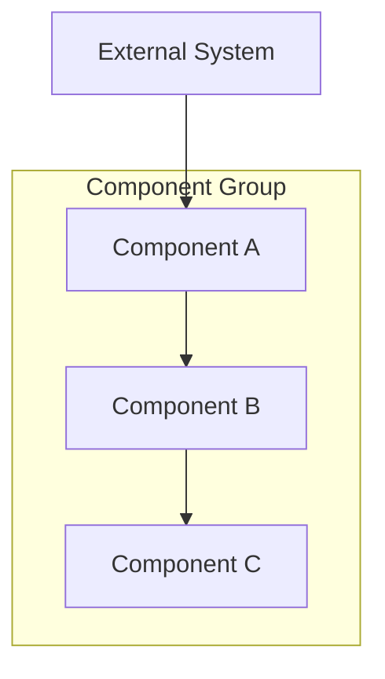
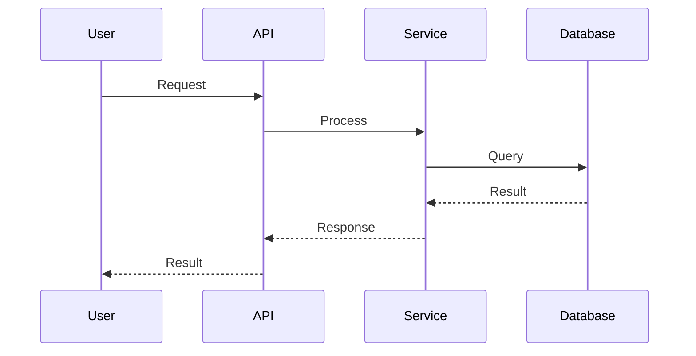

# Design Architecture

Create the technical architecture and design document from requirements.

## Prerequisites

1. Check that `.regent/` directory exists
2. Find the spec to work on (same logic as /regent:specify)
3. Verify `requirements.md` exists in the spec directory
   - If not, tell user to run `/regent:specify` first

## Process

### Phase 1: Analyze Requirements

1. Read `.regent/{spec-name}/requirements.md`
2. Also read `.regent/{spec-name}/brainstorm.md` for additional context
3. Identify:
   - Major system components needed
   - Data flows between components
   - External integrations
   - Data models and schemas
   - Key interfaces and APIs

### Phase 2: Draft Design

Create an initial architecture design covering:
- System components and their responsibilities
- Component interactions and data flows
- Interface definitions with code blocks
- Data models
- Correctness properties (formal invariants)
- Error handling strategies
- Testing approaches

### Phase 3: Clarifying Questions

Ask clarifying questions for technical decisions:
- "Should we use [option A] or [option B] for [component]?"
- "What's the expected scale for [feature]?"
- "How should the system handle [failure scenario]?"

Present options with trade-offs when multiple valid approaches exist.

### Phase 4: Present for Review

Present the complete design document:

```markdown
# Design Document

## Overview
[High-level summary of the technical approach - 2-3 paragraphs explaining the architecture philosophy and key decisions]

## Architecture

### System Components



[Explanation of the diagram and component relationships]

### [Component Name] Flow



[Explanation of the flow]

## Components and Interfaces

### [ComponentName]

[Description of component responsibility and behavior]

```python
class ComponentName:
    """
    [Docstring explaining the component]
    """

    def method_name(self, param: ParamType) -> ReturnType:
        """
        [Method description]

        Args:
            param: [Parameter description]

        Returns:
            [Return value description]

        Raises:
            [Exception conditions]
        """
        ...
```

### [NextComponent]
[Continue for all major components...]

## Data Models

### Database Schema

```sql
CREATE TABLE table_name (
    id UUID PRIMARY KEY,
    field_name VARCHAR(255) NOT NULL,
    created_at TIMESTAMP DEFAULT CURRENT_TIMESTAMP
);
```

[Explanation of schema design decisions]

### [ModelName]

```python
class ModelName(BaseModel):
    """[Model description]"""

    field: FieldType
    optional_field: Optional[FieldType] = None
```

## Correctness Properties

**Property 1: [Property Name]**
*For any* [condition/input], *the system should* [expected behavior/invariant]
**Validates:** Requirements 1.1, 1.2

**Property 2: [Property Name]**
*For any* [condition], *it must hold that* [invariant]
**Validates:** Requirements 2.1

**Property 3: [Property Name]**
*If* [precondition], *then* [postcondition]
**Validates:** Requirements 3.1, 3.2

[Continue for all key properties...]

## Error Handling

### [Error Scenario 1]
- **Trigger:** [What causes this error]
- **Detection:** [How the system detects it]
- **Response:** [How the system responds]
- **Recovery:** [How to recover/retry]

### [Error Scenario 2]
[Continue for all significant error scenarios...]

## Testing Strategy

### Unit Testing Approach
[Strategy for unit tests - what to mock, what to test directly]

### Property-Based Testing Approach
[Strategy for property tests - which properties to test with Hypothesis]

### Integration Testing
[Strategy for integration tests - what to test end-to-end]

### Test Coverage Goals
- Unit tests: [target %]
- Integration tests: [key flows to cover]
- Property tests: [which correctness properties]
```

Ask: "Does this architecture meet your needs? Any concerns about the design decisions?"

### Phase 5: Finalization

On approval:
1. Write to `.regent/{spec-name}/design.md`
2. Confirm:
   ```
   Design saved to .regent/{spec-name}/design.md

   Summary:
   - X components defined
   - Y interfaces specified
   - Z correctness properties

   Next step: Run /regent:plan to generate implementation tasks.
   ```

## Important Notes

- Every correctness property must reference the requirements it validates
- Interface code blocks should be actual, implementable signatures
- Mermaid diagrams should be renderable - test them if unsure
- Properties should be testable with property-based testing frameworks
- Consider failure modes for every component interaction
